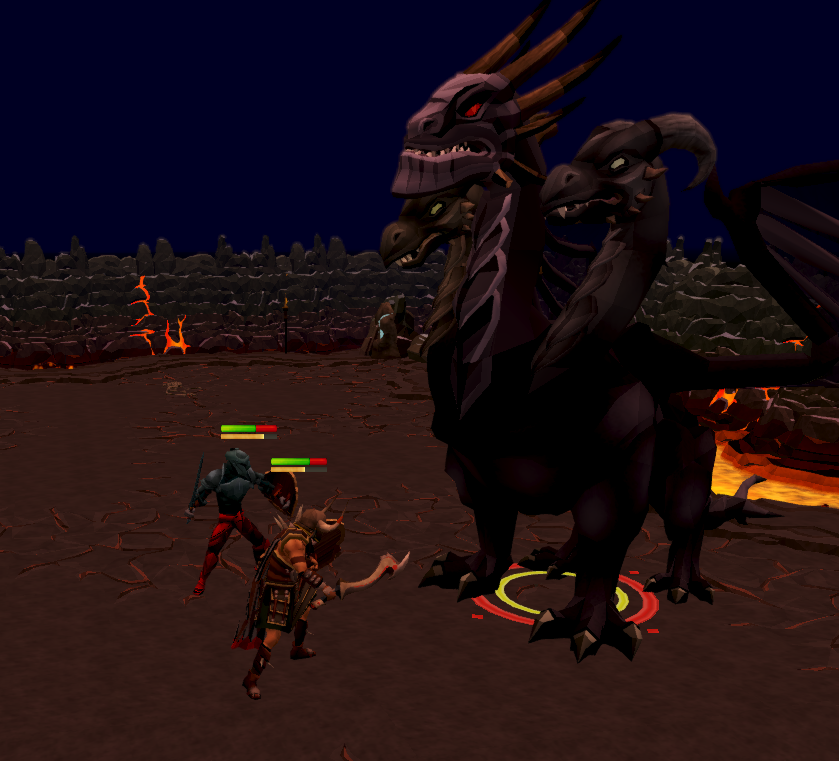

<h1 align="center">Hello 👋🏻</h1>

I'm Jack, a curious thinker with a passion for learning and evolving across different fields. I majored in philosophy, specialized in creative writing, and earned a certification in personal training. I'm currently earning dual master degrees in international business & business analytics.
I've recently grown fond of data analytics, and that's what brought me to the universe of Github.

### 🧰 Tech Toolbox:

| Technologies | Tools |
|-|-|
|  |  **NumPy**,  **Pandas**,  **Scikit-learn**, **Matplotlib**, **Seaborn** |
|  | **Tidyverse**: **dplyr**, **ggplot2**, **tidyr**, **readr**, **stringr**, **lubridate**,   **broom**, **reshape2** |
| IDEs |  **Anaconda**,  **Jupyter**,  **RStudio**,  **VS Code** |
| Others |  **SQL**,  **Markdown**,  **Git**,  **Tableau**|

### 📈 Github Stats:

<!--
**JackDaoud/JackDaoud** is a ✨ _special_ ✨ repository because its `README.md` (this file) appears on your GitHub profile.

When I'm not analyzing things, I enjoy reading philosophy and playing video games like RuneScape, League of Legends, or Valorant.

Here's my RuneScape champion battling the King Black Dragon with a friend!

P.S. I'm the one with the horned helmet & squiggly sword

Here are some ideas to get you started:

- 🔭 I’m currently working on ...
- 🌱 I’m currently learning ...
- 👯 I’m looking to collaborate on ...
- 🤔 I’m looking for help with ...
- 💬 Ask me about ...
- 📫 How to reach me: ...
- 😄 Pronouns: ...
- ⚡ Fun fact: ...
-->
