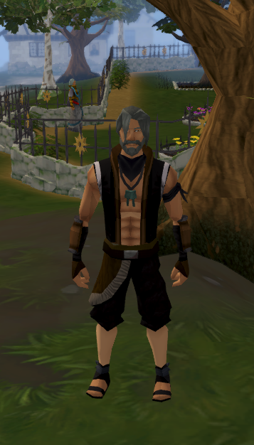

<h1 align="center">Hello 👋🏻</h1>

I'm Jack, a curious thinker with a passion for learning and evolving across different fields. I majored in philosophy, specialized in creative writing, and earned a certification in personal training. I'm currently earning dual master degrees in international business & business analytics.

You can find me on: 

 

I've recently grown fond of data analytics, and that's what brought me to the universe of Github.

Overview of my Github Stats:

Overview of my Toolbox:

<h1 align="center"> </h1>

When I'm not analyzing things, I enjoy reading philosophy and playing video games like RuneScape, League of Legends, or Valorant.

Meet *Elusivebeing*, my RuneScape champion!

<!--
**JackDaoud/JackDaoud** is a ✨ _special_ ✨ repository because its `README.md` (this file) appears on your GitHub profile.

Here are some ideas to get you started:

- 🔭 I’m currently working on ...
- 🌱 I’m currently learning ...
- 👯 I’m looking to collaborate on ...
- 🤔 I’m looking for help with ...
- 💬 Ask me about ...
- 📫 How to reach me: ...
- 😄 Pronouns: ...
- ⚡ Fun fact: ...
-->
